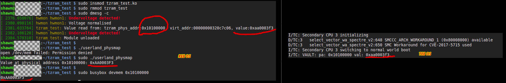

## ARM TrustZone Audit: Securing vs. Non-Securing Memory Separation

ARM TrustZone is designed to partition memory into two worlds: the non-secure world running the Rich Execution Environment (REE, such as Linux/Android) and the secure world running the Trusted Execution Environment (TEE OS). It has been widely deployed across industries such as automotive, mobile, and hardware wallets. Key points:

* The Linux kernel runs in Non-Secure EL1 (NS.EL1).
* The TEE OS runs in Secure EL1 (S.EL1).
* The secure monitor (e.g., ARM Trusted Firmware, ATF) runs in Secure EL3 (S.EL3).
* The Linux kernel issues SMC (Secure Monitor Call) instructions to the secure monitor, which then routes requests to the TEE OS.
* The ARM core architecture doesn't have a security extension for the MMU by default. This means that if SoC vendors do not integrate dedicated IP for TZASC (TrustZone Address Space Controller), memory isolation between the two worlds will not be effective.
* Any peripherals that require secure handling must be managed by the secure world. Thus, the SoC must integrate additional IP for TZPC (TrustZone Protection Controller). This approach is significantly different from the x86_64 ecosystem, which uses MMU, IOMMU, EPC, SGX, or TDX.
* The ARM reference model allows the same physical address of secure and non-secure world (e.g., non-secure physical address at np:0x1000 and secure physical address at sp:0x1000) referring to different location of the whole memory system. However, most SoC vendors tend to avoid this complexity (i.e., np:0x1000 and sp:0x1000 refer to the same location).
* Compared to x86, the ARM TEE is more analogous to the System Management Mode (SMM).

## Trust but verify on the hardware lack of TZASC/TZPC:

## Reference
Embedded system security
https://github.com/hardenedlinux/grsecurity-101-tutorials/blob/master/embedded_platform_security.md

ARM TrustZone for Armv8-A
https://developer.arm.com/-/media/Arm%20Developer%20Community/PDF/Learn%20the%20Architecture/TrustZone%20for%20Armv8-A.pdf

Armv8-A Address Translation
https://documentation-service.arm.com/static/5efa1d23dbdee951c1ccdec5

Introduction to Trusted Execution Environment: ARM's TrustZone 
https://blog.quarkslab.com/introduction-to-trusted-execution-environment-arms-trustzone.html

Firmware security 3: Digging into System management mode (SMM)
https://nixhacker.com/digging-into-smm/

Analysis and Evaluation of Hardware Trust Anchors in the Automotive Domain
https://dl.acm.org/doi/fullHtml/10.1145/3538969.3538995

Attacking TrustZone on devices lacking memory protection
https://link.springer.com/article/10.1007/s11416-021-00413-y
